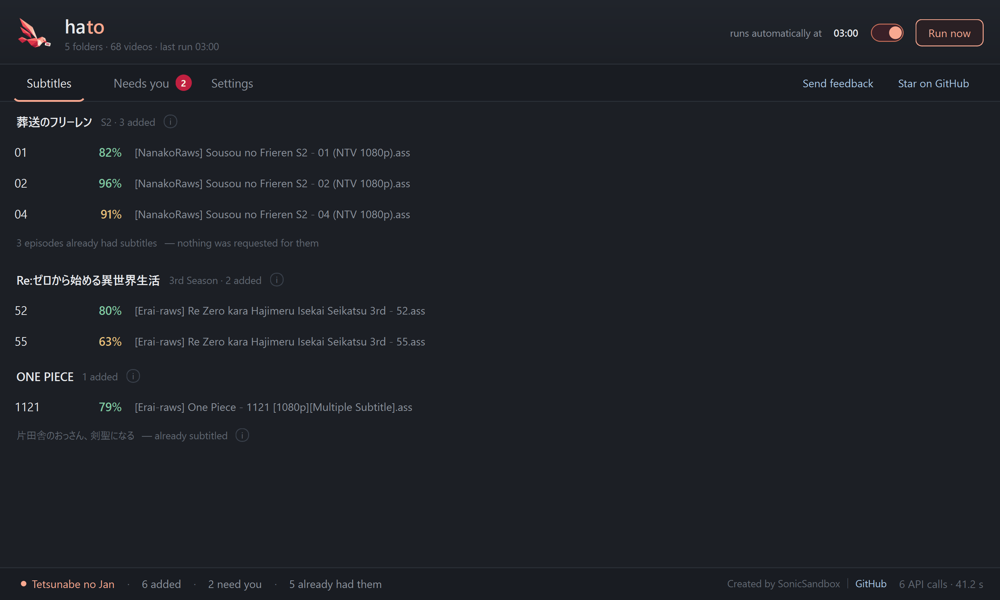
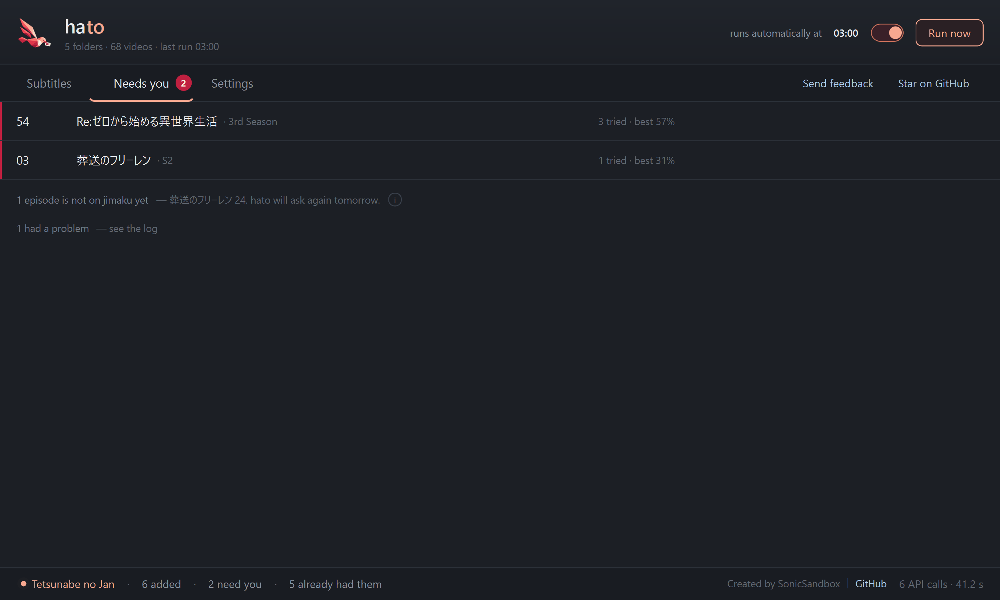
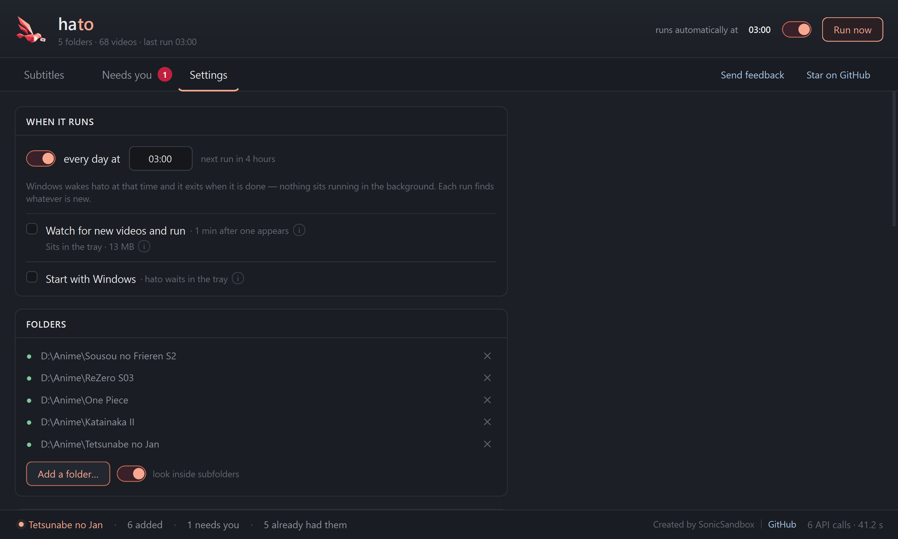
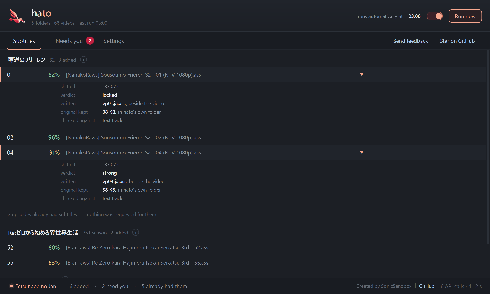

<p align="center">
  
</p>

<h1 align="center">hato&nbsp;&nbsp;鳩</h1>

<p align="center">
  <b>Japanese subtitles for your Japanese video.<br>
  Found, matched, and timed — without you doing anything.</b>
</p>

<p align="center">
  <sub>Point it at a folder. Leave it running. New episodes get their subtitles on their own.</sub>
</p>

---

## The short version

You have Japanese video. You want Japanese subtitles for it.

hato works out what each video **is**, finds the matching subtitle on
[jimaku.cc](https://jimaku.cc), and puts it next to the video under a name every
media player already loads.

Then it keeps doing it. Leave hato in your tray and the next episode you download
has its subtitle waiting for you.

<p align="center">
  
</p>

---

## What it actually does

**Works out what the video is.**
Not by folder names, not by `SxxExx`. It reads the filename the way a person does —
release group, season, episode, the romanised or Japanese title — and resolves it to
the right show.

**Finds the subtitle that goes with *your* copy.**
There are usually several. It picks by which release it came from and tries the next
one if the first does not fit.

**Times it to your exact file.** ⭐
This is the part nobody else does. A subtitle written for a different release is
seconds out — sometimes minutes, sometimes drifting scene by scene. hato hands it to
[tsubasa](https://pypi.org/project/tsubasa-sync/), which re-times it against your
video and **refuses to write anything it cannot verify**.

**Keeps watching.**
Turn it on and hato sits in the tray at about 13 MB. A new episode lands in a watched
folder, hato waits a minute for the download to finish, then goes and gets the
subtitle. You do nothing.

---

## No library required

No media server. No Sonarr, no Radarr, no Plex. No library renamed into a scheme
first.

**A folder is enough.**

---

## Get it

### Windows — the app

Download the zip from [Releases](https://github.com/SonicSandbox/hato/releases),
unzip it anywhere, and run **`hato.exe`**.

Nothing to install. Python is already inside it.

### Any platform — from source

```bash
git clone https://github.com/SonicSandbox/hato
cd hato
pip install "tsubasa-sync[parsing]>=0.1.6" requests
```

Python 3.10 or newer. On 3.10 also `pip install "tomli>=1.1"` — 3.11 has it built in.

Run it from inside that folder:

```bash
python -m hato ~/Anime/Some\ Show      # the command line
python -m hato.gui                      # the window
python -m hato.watch                    # the tray watcher
```

**The window needs Qt**, which the line above does not install — it is about
70 MB and the command line does hato's whole job without it:

```bash
pip install "PyQt6>=6.5"
```

> ⚠ **hato is not installed onto your PATH by any of this.** It is a program
> you run from its own folder, not a package — so it is always
> `python -m hato`, never a bare `hato`. On Windows you can also drag a folder
> onto `hato-run.cmd`, or double-click `hato-gui.cmd` for the window.

### The key

jimaku's API needs a free key from your jimaku.cc account. In the app, open
**Settings → Jimaku key** and paste it — hato tests it there and tells you whether it
works.

From the command line:

```bash
python -m hato key --set-from /path/to/a/file-with-the-key
```

From the Windows download, the command line is `hato-cli.exe` — so
`hato-cli.exe key --set-from …`. (`hato.exe` is the **window**.)

It never goes in a config file, and hato never prints more than its last four
characters.

---

## When it isn't sure, it asks

hato will not guess. If two candidates both look plausible, or none of them times
cleanly, the episode goes to **Needs you** instead of being written badly.

<p align="center">
  
</p>

---

## Set it and forget it

<p align="center">
  
</p>

| | |
| --- | --- |
| **Run every day** | A sweep at a time you pick. hato exits when it is done |
| **Watch for new videos** | Sits in the tray and runs a minute after something appears |
| **Start with Windows** | hato is already watching when you sit down |

> **A note about airing shows.** For a season still going out, the subtitle is
> published hours to days *after* the episode. Watching works best on finished shows;
> for airing ones the daily sweep catches up.

---

## Every answer is inspectable

Click any row to see what happened — how far it was shifted and from where, what the
timing verdict was, what was written and what it was checked against. And **Open
video** plays it.

<p align="center">
  
</p>

---

## It won't do the same work twice

- A video that already has a Japanese subtitle is **skipped before any request**.
- A video whose container already carries a Japanese text track needs nothing.
- A show that resolves cleanly is **remembered**, and later runs reuse it.
- An episode jimaku does not have yet is retried tomorrow, not every run.

jimaku allows 25 requests a minute and failed requests count, so hato treats the
network as the scarce resource and the disk as free. **The cost scales with how many
SHOWS you have, not how many episodes** — identifying one show takes 1 call when the
first guess lands, 2 for live action, and up to 3 plus 2 to a second service when it
has to work harder.

> ⚠ **"Remembered" is not "once and never again."** A show is looked up again if the
> entry turns out to hold nothing, 404s, or fails timing on every episode — hato
> deliberately forgets a bad answer rather than keeping it. And listing an entry's
> files costs one call per show per run. Downloads themselves are unmetered and need
> no key.

---

## What it will not do

- **Write anything it isn't sure about.** Nothing is written unless tsubasa's timing
  verdict holds.
- **Leave scratch files in your media folder.** Downloads and unpacking happen in a
  cache directory. Only the finished file goes near your videos.
- **Delete your files.** Ever.
- **Re-encode or convert a subtitle.** `.ass` stays `.ass`, in its original encoding.
- **Sync a video with no subtitle track at all.** There is nothing to check the timing
  against, so those are skipped and reported — not guessed at.
- **Redistribute anything.** Subtitles are downloaded to your machine, at your
  request.

---

<details>
<summary><b>The command line</b> — everything the window does, scriptable</summary>

<br>

The window is a front end. All of it works from a terminal.

> ⚠ **Write it the way your install actually provides it.** From a clone that
> is `python -m hato`; from the Windows download it is `hato-cli.exe`, beside
> `hato.exe`. Nothing puts a bare `hato` on your PATH. The examples below use
> `python -m hato`.

```bash
python -m hato ~/Anime/Some\ Show      # one folder, recursive
python -m hato ~/Anime/A ~/Anime/B     # several
python -m hato                         # every folder in your config
python -m hato ~/Anime --dry-run       # plan it; download nothing, write nothing
```

**Start with `--dry-run`.** It identifies every show, says what it *would* fetch, and
touches nothing.

A real run looks like this:

```
hato  ~/Anime/Katainaka S2                                     24 videos

  片田舎のおっさん、剣聖になる  S2
  ↳ parsed "Katainaka no Ossan Kenseininaru" → jimaku entry 3841
                                                    2 API calls · 26 files listed

  ✗  07   NOT FOUND   jimaku 3841 has no episode 7 — will retry after 2026-09-14
  ✗  12   REFUSED     2 candidates fetched, both failed timing (81%, 74% match)

  ⊙  01 02 05         subtitle already present — skipped, no request made
```

Subtitles land beside the video as `<video>.ja.<ext>` — the one naming form Plex,
Jellyfin and Emby all document. The original download is kept separately, so a
subtitle you delete can be re-synced with no network calls at all.

### Flags worth knowing

| | |
| --- | --- |
| `--out DIR` | Write there instead of beside the video, mirroring the source tree |
| `--candidates N` | How many candidates to try before giving up. Default 3 |
| `--force` | Ignore the state DB — re-try past refusals, re-query past misses |
| `--archives` | Open `.zip` / `.7z` / `.rar` candidates. **Off by default** — unpacking a stranger's archive is opt-in |
| `--lang CODE` | Default `ja` |
| `--json` | NDJSON, one object per video, then one for the run |
| `--quiet` | Print nothing; the log is the record. What a scheduled run uses |

Archive support needs the two guarded extras, **with their floors** — the `.7z` stall
guard reaches into py7zr's internals and fails closed without them, so an older release
unpacks nothing:

```bash
pip install "py7zr>=1.1.3" "rarfile>=4.0"
```

`.rar` additionally needs an external `unrar` (or `unar`, `7z`, `bsdtar`) on your PATH.
Without any of these, archive candidates are skipped with a message that names the
flag — nothing errors.

### Subcommands

Each answers one question, and most cost nothing:

```
python -m hato doctor       is the live API still what we think? every gate, measured
python -m hato identify     which jimaku entry is this video? the entry, its score, the cost
python -m hato files        every file on one jimaku entry, with sizes
python -m hato align        which of an entry's files could be which video in a folder
python -m hato rank         the order one episode's candidates would be tried in, and why
python -m hato sync         sync ONE subtitle against ONE video, print what tsubasa said
python -m hato state        what the state DB remembers, and when each miss is retried
python -m hato blacklist    never fetch for this video — and the way back
python -m hato cache        where the working cache is and how big it has got
python -m hato config       the resolved config; or check that the key resolves
python -m hato key          where the key comes from, or set one
python -m hato extract      unpack one archive into the cache and list what came out
```

### Scheduling it yourself

**If you installed the app, you do not need any of this** — the **Run every day**
switch in Settings registers it for you, and **Start with Windows** keeps the watcher
running. This section is for driving it yourself.

```bash
python -m hato --quiet          # from a clone: cron, a systemd timer, Task Scheduler
hato-cli.exe --quiet            # from the Windows download
```

On Windows from a clone, point Task Scheduler at `hato-run.cmd` — ⚠ that launcher is
part of the repository and is **not** in the standalone zip, where `hato-cli.exe` is
the thing to point at.

Set `-AllowStartIfOnBatteries -DontStopIfGoingOnBatteries -StartWhenAvailable`. The
default is *don't start on battery*, and a task that never ran reports the same
`Last Result: 0` as one that succeeded. **Read hato's own log**
(`%LOCALAPPDATA%\hato\hato.log`), never the scheduler's result code.

</details>

---

## Related

[**tsubasa**](https://pypi.org/project/tsubasa-sync/) — the engine underneath. Pairs
subtitles to videos and re-times them by cue timing rather than text, so it works in
any language. Useful on its own, and it never touches the network.

---

## Licence

GPL-3.0-or-later. See `LICENSE`, and `THIRD_PARTY_LICENSES.md` for dependencies.

Subtitle content on jimaku is user-uploaded fansub work with no stated licence. hato
downloads it to your machine at your request and redistributes nothing.
